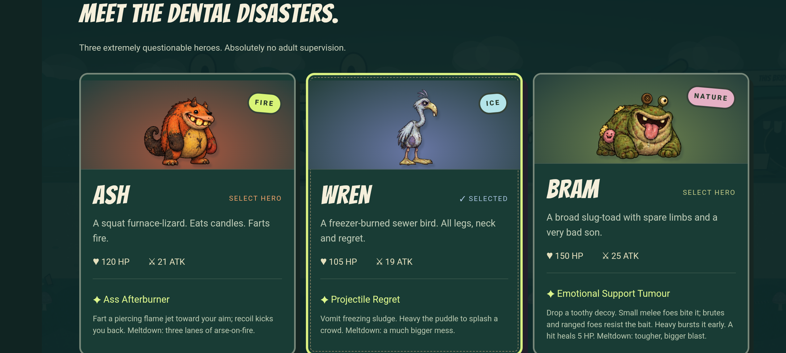

# Emberbound: The Hollow Crown

An original, offline fantasy beat ’em up for Android, iOS, and the browser. Guide a scruffy, toothy plush monster through six regions and recover six stolen crown teeth. Version 0.31 replaces every non-menu score with the user's ten Udio recordings across twelve chapters, plus 24 boss/result excerpts. The main-menu recording stays unchanged and attempts automatic playback where the host permits it. It includes 0.30's new hero attacks, painted enemy creatures, blood, Heavy-spam counters and eighteen extra interactive districts. [Soundtrack assignments](docs/UPDATE-0.31.md), [gameplay changes](docs/UPDATE-0.30.md), [validation](docs/VALIDATION.md). Human enjoyment and physical-device/native iOS release verification remain open.

[Follow development and collaborate on Brightmoot](https://brightmoot.com/m/emberbound-the-hollow-crown).



## Play

[Play the browser prototype](https://brightmoot.com/media/emberbound/playtest.html)—no install or account required. Try the opening encounter, then share one confusing moment on Brightmoot. Posting feedback requires signing in.

To run it locally:

```bash
npm ci
npm run dev
```

Open the printed local URL. Phones on the same network can use the printed network address. Native builds contain the game assets and do not need that server.

Locally generated build outputs go in `artifacts/` (not included in this repository): `emberbound-debug.apk` is installable on Android; `emberbound-release-unsigned.aab` is an **unsigned** release bundle, not a store-ready upload. The iOS Xcode project is in `ios/App/`.

## Included

- Three poorly behaved plush heroes: Ash’s Ass Afterburner, Wren’s Projectile Regret, and Bram’s Emotional Support Tumour. Each has mismatched eyes, irregular teeth, stitched patches, and a ridiculous household weapon.
- Six long journey chapters (10,430–13,080 world units), six dedicated boss chapters, 72 authored encounters, eight ordinary enemy classes, and six bosses with distinct attack and recovery patterns.
- Timed light/heavy moves, launch/juggle follow-ups, enemy bowling, a level-3 deliberate spin, an empowered level-5 dodge launcher, a level-7 diving flomp, independent jump height, depth-aware collision, dodge invulnerability, magic regeneration, gold and healing drops.
- Stitched woodland, ice-cream highlands, a washing-machine marsh, candy factory, junkyard, and cardboard citadel. Dedicated arena set dressing and actual scenery previews on the map.
- Eight equipment choices: hero starting gear plus seven discoverable weapons with speed, reach, damage, and special perks. An armory and combo journal explain every unlock.
- Six region-specific machinery hazards: spores, sweeping freezer cutters, pulling drains, sticky syrup, overhead factory presses and royal tax stamps. Warning/active/cooldown phases share timing with collision; hazards damage enemies, and bonkable switches disable them. Persistent stuffing and tooth debris mark the aftermath.
- Six workplace sabotage encounters: three Heavy hits or one bowled foe starts a single disaster that can hurt both sides. Bowling pays a larger one-time bonus; retries restore the machinery and rewards.
- Narrow bridges, cart escorts, napping/drop-in ambushes, linked gates, explosive bean barrels, weapon/snack chests, springs, vents, and delayed bombs. Madame’s open drum can be jammed by bowling laundry into it. A field guide explains enemy counters and scenery interactions.
- A campaign map, persistent chapter unlocks, three permanent upgrade tracks, medals, ten substantive combat levels, a six-tooth collection tracker, victory and defeat flows.
- Multi-touch joystick and buttons, keyboard, standard-mapped gamepad, pause, settings, application lifecycle handling, and input buffering.
- Original painted hero and ordinary-enemy sheets with procedural boss artwork, ten user-selected Udio recordings across twelve chapters, 24 regional musical excerpts, a responsive mixer, synthesized impact effects, and the user-selected Udio menu track. See `public/audio/SOURCE.md` for audio provenance. Native icons and splash artwork remain.
- Native preferences on Android/iOS, validated/versioned saves, and a browser storage fallback.
- Android and iOS platform projects, reproducible dependency lockfile, unit/integration/browser tests, and CI configuration.

**Scope:** This is a playable solo/local-co-op campaign; native release validation and human balance testing remain. There is no online co-op, matchmaking, cloud save, or monetization. One local adventure bookmark stores fight entrances and cleared roads across app sessions. Continue opens paused and counts as a retry; Save & quit waits for storage. Starting another adventure explicitly replaces the bookmark. Leveling adds health and power, heals in battle, and unlocks combos. A win banks all earned currency and XP. Accepting defeat by returning to camp or restarting the chapter retains weapons, loses currency and pays only 25% of XP above that chapter’s previous best failed haul; repeating the same failed route pays no further XP. Boss victories grant permits for later permanent upgrade ranks. Existing purchased upgrades survive migration. Retrying a fight restores its exact start, including health, equipment, switches and rewards; failed-fight loot resets, and previous fights stay cleared. Retries do not bank anything. Returning to camp without saving abandons the ongoing run and forfeits unbanked rewards. The third mastery star requires a fast win without retries. Uninstalling clears local progress.

Choose **Scrapper**, **Acrobat**, or **Hexer** in Back-alley surgery → Armory & combos from level 2. These unlock counter/quakes, air-dash kicks/jump cancels, or elemental finishers. The choice persists and can be changed freely at camp. Veterans, shield ripostes, aimed high shots and half-health boss escalation create new threats. See [fighting styles](docs/UPDATE-0.5.md) for unlocks and [current validation](docs/VALIDATION.md) for balance evidence.

Connect attacks outside your last three move types, splash sludge or time a late dodge to earn **FILTH**. At 100%, the next power is a free enhanced **MELTDOWN**. Heavy detonates sludge/decoys. Brutes and ranged enemies ignore the decoy lure. Orange-ringed enemies briefly resist control after prolonged stun or knockdown.

## Controls

| Action | Keyboard | Standard gamepad | Touch |
| --- | --- | --- | --- |
| Move | WASD / arrows | Left stick / D-pad | Left joystick |
| Jump | Space / I | A / bottom face button | Jump |
| Light | J | X / left face button | Light |
| Heavy | H | RB / right bumper | Heavy |
| Power / Meltdown | K | Y / top face button | Power |
| Dodge | L / Shift | B / right face button | Dodge |
| Pause | Escape / P | Start | Pause icon |

**Menus:** D-pad / arrows move the stitched outline; A / × or Enter selects; B / ○ or Esc goes back. Confirming a chapter enters it. Start resumes a paused fight. A disconnected controller pauses solo and co-op.

Hold light for quick bonks. **Heavy → Jump → Light** launches and juggles; **Light ×2 → Heavy** bowls; **Jump → Heavy** dives. Level 3 unlocks **Light ×3 → Heavy** spin. Weapon-specific heavy moves take precedence: the pan bowls and the sock pulls. **Dodge → Heavy** launches with any ordinary weapon and becomes stronger at level 5. Level 7 upgrades the diving flomp. Bonk levers and stashes; walk onto springs; move, jump, or dodge telegraphed attacks. Melee restores magic. Escort carts to their marked destination to clear those encounters.

Choose **Bring a friend** on the world map for local co-op. P1 uses WASD + J/H/K/L/Space or touch. P2 uses arrows + numpad 1/2/3/4/0 (light/heavy/magic/dodge/jump), or a gamepad. One connected pad belongs to P2; two pads get one player each. Hold POWER beside a downed friend for two seconds to revive. The device owns shared gold, XP and discoveries; P1’s equipped weapon persists.

**Try Madame’s boss fight** on the map starts a practice chapter without requiring campaign unlocks or banking its rewards. **Relaxed battles** in settings applies reduced damage and extra recovery to the next chapter. Touch works in landscape and portrait; landscape is preferred.


## Build and test

```bash
npm run test         # mechanics, co-op, save, jump, and continuous campaign tests
npm run build        # strict TypeScript and optimized static web build
npx playwright install --with-deps chromium webkit
npm run test:android # installed APK on the dedicated Android emulator; see scripts/native/README.md
npm run test:e2e     # desktop Chromium, Android-sized Chromium, iPhone-sized WebKit
npm run mobile:sync  # rebuild web assets and copy them into both native projects
```

The tests in `campaign.test.ts` complete all twelve chapters with each hero and each fighting style using carried, earned progression and affordable upgrades, plus an opening chapter with two independently controlled partners. They use real movement/combat inputs without teleporting or editing HP. Focused tests verify combat contacts, input queues, juggling, bowling, boss openings, authored objectives, revives, and save compatibility. Browser tests cover touch/keyboard, controller assignment, menus, reloads, pause and practice.

See [0.29 changes](docs/UPDATE-0.29.md), [the human playtest kit](docs/PLAYTEST.md), and [future online co-op design](docs/ONLINE-COOP-PLAN.md). The 432-run strategy audit is not human enjoyment evidence.

See [release instructions](docs/RELEASE.md) for platform tools, signing, validation status, and remaining release work. See the repository’s Actions tab for hosted CI results.

## Code map

| File | Responsibility |
| --- | --- |
| `src/engine.ts` | Seeded, fixed-step game simulation with no browser dependency |
| `src/content.ts` | Heroes, regions, weapons, XP thresholds, combos, enemy guide |
| `src/progression.ts` | Fighting style definitions and level-gated techniques |
| `src/combat.ts` | Timed moves and deliberate combo selection |
| `src/encounters.ts` | Authored enemy groups, encounter objectives, and lane bounds |
| `src/render.ts` | Camera, parallax scenery, actors, effects, original vector art |
| `src/plush.ts` | Creature drawing entry point, weapon art and portrait caching |
| `src/creature-art.ts` | Separate hero/enemy anatomy and action-driven motion |
| `src/boss-art.ts` | Six boss bodies with state-driven limbs, machinery, transformations and defeats |
| `src/boss-performance.ts` | Boss scene definitions and sound identities |
| `src/impact-art.ts` | Bounded hit stars, launch streaks, guard fragments and death stuffing |
| `src/scenery.ts` | Stitched diorama environments and real map thumbnails |
| `src/world-art.ts` | Interactive props, gate states, and timed hazard artwork |
| `src/input.ts` | Buffered keyboard/touch input and gamepad polling |
| `src/audio.ts` | Local menu/chapter audio transport and synthesized impact effects |
| `src/setpieces.ts` | Regional machinery placement and shared warning/collision timing |
| `src/grime-art.ts` | Oversized ruined landmarks, regional machinery, and lasting battle debris |
| `src/story.ts` | Campaign dialogue, hero variants, and finale |
| `src/run-session.ts` | Exactly-once outcome settlement and provisional defeat/retry flow |
| `src/defeat.ts` | Damage attribution and specific counter advice |
| `src/menu-input.ts` | Controller/keyboard menu navigation and focus across redraws |
| `src/input.ts` | Combat input, co-op ownership and release barriers |
| `src/defeat-ui.ts` | Comic incident report and immediate retry controls |
| `src/save.ts` | Save validation, serialized durable writes, boss permits and capped defeat payouts |
| `src/filth-art.ts` / `src/filth.css` | Sludge/decoy art and the gross-out interface |
| `src/main.ts` | Screens, lifecycle, reward banking, frame loop |
| `src/style.css` | Responsive interface and touch control layout |

Rendering is separate from simulation. The simulation runs at 60 fixed steps per second; long frames are capped, hidden apps pause, device pixel ratio is capped at two, particles are bounded, and only visible 1,024-unit terrain chunks are retained. Canvas has no runtime image/font downloads. Menu audio is bundled locally and starts after the first user gesture. For substantially larger enemy counts or a larger content pipeline, profile on the target devices before choosing a GPU renderer or asset pipeline.

## Assets and dependencies

The game’s artwork, characters, setting and text were created for this project. The menu and chapter soundtrack use user-supplied Udio recordings; regional cues are edited excerpts. See [audio provenance](public/audio/SOURCE.md). No Castle Crashers assets, names, story, or code are included. Artwork is canvas/SVG code; chapter music and cues are rendered recordings, and combat effects are synthesized. `scripts/capture.mjs` captures screenshots and rasterizes the icon; `scripts/native-assets.py` uses Pillow to generate native sizes.

Runtime dependencies are Capacitor and its App/Preferences plugins. Development dependencies retain their own licenses. The scoped `xcode → uuid@11.1.1` override fixes a dependency advisory while preserving the CommonJS `v4()` API used by the Xcode project parser.

Save schema 2 migrates existing version-1 progress while keeping the original storage key. Old wood/pass victories map to their new journey/boss pairs, and completed keep saves retain their crown victory. See [0.3 changes](docs/UPDATE-0.3.md) for mechanics and migration details.

## Permissions

This public repository shares the project for viewing and collaboration. No general open-source license is granted at this time. Third-party dependencies and recordings retain their applicable terms; audio provenance is documented above.
